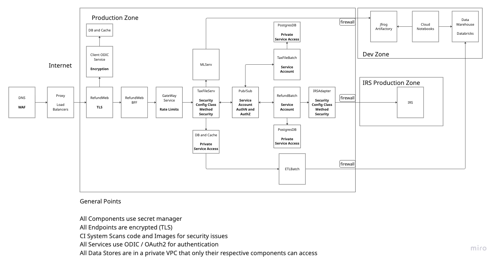

# Tax Refund System Design Presentation

## Table of Contents
1. [About Me](#about-me)
2. [Professional Acheivements](#professional-achievements)
3. [System Design](#system-design)
4. [Q&A Session](#qa-session)

---

## About Me

### Personal Life
• Live in Atlanta area with my spouse and 2 young kids

• I Work from home and Travel occasionally for work

### Geographic Journey
• **Grew up in Coimbatore, India** - where I discovered my love for technology, like selling PCs 

• **Started career in Pune, India** - learned fundamentals of software development

• **Moved to US in 2012** for work opportunities

• **Lived in Bay Area** - expereinced Silicon Valley tech culture

• **Moved to Chicago** - experienced a different tech ecosystem

• **Currently in Atlanta** - worked for 3 different companies, gained solid knowledge about technology and business and how they are **inter-dependant**

### Professional Passions
• **Love working with young engineers** - helping them grow and develop

• **Active in hackathons** - attend and participate regularly (now a days mostly internal)

• **Co-judge at hackathons** - witness incredible creativity and innovation (Conducted in Georgia Tech)

• **Networking events** - building connections and learning from peers, especially how AI is going to evolve. 

### Intellectual Interests
• **Philosophy enthusiast** - especially Epistemology (study of knowledge)

• **Karl Popper** - his ideas about falsifiability influence my problem-solving

• **Economics and Business** - fascinated by intersection with technology

• **Systems thinking** - understanding how both software and economic systems work

### Personal Hobbies
• **Blogging** - though admittedly inconsistent (working on it!)

• **Running 5Ks** - especially ones that end with celebratory drinks

• **Reading** - philosophy, economics, and business books

## Did you notice a theme ?

I seem to like **Marathons**, **Hackathons** and **Readathons** 😄

---

## Professional Achievements

### Credit Externalization Platform - KKR & PayPal Partnership
• **Project Overview**: 
    - Led the design of a platform for KKR's acquisition of €40bn European BNPL loans from PayPal
    - Converted this in to a re-useable platform which is currently being used for Blue Owl, an investor in US

• **Business Impact**: Enabled PayPal to free up capital while KKR gained access to diversified consumer loan portfolio

• **Technical Components**:
  - **BigQuery Data Lake**: Centralized data storage, Analytics and reporting 
  - **Business UI**: A frontend where business sets the rules and tracks progress and communicates with backend
  - **GKE Batch Jobs**: Config Based eligibility filters and report criteria. Daily, Weekly and Monthly Jobs
  - **Risk Platform Integration**: Connected with PayPal Risk Platform
  - **Client Systems Interface**: Seamless data transfer and reporting to investment company's systems

• **Partnership Success**: Transaction successfully closed in 2023-2024

• **Platform Reused**: Currently being re-used in US and In discussions in other markets

• **References**: 
  - [PayPal-KKR Deal Announcement](https://www.fintechfutures.com/bnpl-payments/paypal-to-sell-up-to-40bn-of-european-bnpl-loans-to-kkr)
  - [KKR Asset-Based Finance Insights](https://www.kkr.com/insights/asset-based-finance-buy-now-pay-later)

### Predictive Test Selection Platform
• **Project Origin**: Started as side project after reading Meta's research paper on predictive test selection

• **Problem Identified**: Tests failing due to irrelevant issues, wasting CI/CD resources and developer time

• **Leadership Role**: Led initiative to build intelligent test selection system

• **Key Features Implemented**: [Detailed Feature List](predictive-test-selection-features.md)

• **Technical Implementation**:
  - **ML Model**: XGBoost for tabular data with mixed-type features
  - **Inference Service**: FastAPI-based REST API for real-time predictions
  - **Integration**: Seamless CI/CD integration with build systems

• **Operational Excellence**:
  - **Model Versioning**: Joblib export with rollback capabilities
  - **Retraining**: Automated monthly/monthly model updates

• **Research Foundation**: Based on [Meta's Predictive Test Selection Research](https://research.facebook.com/publications/predictive-test-selection/)


---

## System Design: Tax Refund Status Service

### Problem Statement

[Problem Statement](problem_statement.md)

Focus Areas - Efficiency, Reliability, Secure, Highly Available, Usability

### Requirements 

**Functional Requirements:**
1. User goes to our web, and checks refund status
2. If its refunded, it must say so
3. Else, it should show the predicted date of refund
4. If there are any problems with refund, it should show next steps
5. Data Pipeline for AI Model


**Security Requirements:**
1. Users must be authenticated and authorized
2. All services involved must have an authentication and authorization mechanism 
3. There must be minimal public internet exposure
4. PII must be encrypted at rest and in transit 


**Efficiency requirements:**
1. Each service must have low latency (<200ms) even when there is high traffic 
3. The whole solution must be highly available - 99.99% and zero down time deployments

**Reliability:**
1. Info shown to the customers must be accurate / near real time
2. Our System must be reliable as well - Even if parts of the system fail, rest should work

**Observability:**
1. Alerts when there is an issue
2. Easy to troubleshoot the issues

**Testability:**
1. Each component must be individually testable
2. Strong integration tests

### High Level Design

**High Level Components**

 

**Security Design**

 

**Key Security Considerations**
- Network Security
- Cloud VPCs
- Cloud Security 
- Applicaiton Security JWT auth
- Data Security 

**Performance**
- Load Balancers
- Auto scaled Cluster
- Cacheing
- Loose Coupling 

**Data Pipeline**

- ETL job to load data in Data Bricks (Or OSS Apache Spark)
- Regular Model Re-Training
- Oberve Model Drifting based on real time prediction errors

### Low Level Design 

#### Data Model

**Core Entities:**

**TaxFile Entity (Java/Spring Boot)**

| Field | Type | Constraints | Description |
|-------|------|-------------|-------------|
| id | UUID | PRIMARY KEY, Generated | Unique identifier |
| userId | String(100) | NOT NULL | User identifier |
| year | Integer | NOT NULL | Tax year |
| income | BigDecimal(14,2) | NOT NULL, >= 0 | Annual income |
| expense | BigDecimal(14,2) | NOT NULL, >= 0 | Annual expenses |
| taxRate | BigDecimal(5,2) | NOT NULL, 0-100% | Tax rate percentage |
| deducted | BigDecimal(14,2) | NOT NULL, >= 0 | Amount deducted |
| refundAmount | BigDecimal(14,2) | NOT NULL, >= 0 | Refund amount |
| taxStatus | Enum | NOT NULL | PENDING, COMPLETED |
| createdAt | LocalDateTime | NOT NULL | Creation timestamp |
| updatedAt | LocalDateTime | NOT NULL | Last update timestamp |

**Refund Entity (Java/Spring Boot)**

| Field | Type | Constraints | Description |
|-------|------|-------------|-------------|
| id | UUID | PRIMARY KEY, Generated | Unique identifier |
| taxFile | TaxFile | OneToOne, NOT NULL | Associated tax file |
| refundStatus | Enum | NOT NULL | PENDING, IN_PROGRESS, APPROVED, REJECTED, ERROR |
| refundErrors | JSONB | NULL | Error details in JSON format |
| refundEta | LocalDateTime | NULL | Estimated time of arrival |
| createdAt | LocalDateTime | NOT NULL | Creation timestamp |
| updatedAt | LocalDateTime | NOT NULL | Last update timestamp |

**Refund Entity (Go/Batch Processing)**

| Field | Type | Constraints | Description |
|-------|------|-------------|-------------|
| ID | uint | PRIMARY KEY | Auto-increment ID |
| FileID | string | UNIQUE, NOT NULL | Tax file identifier |
| Status | string | NOT NULL, default: 'pending' | Refund status |
| ErrorMessage | *string | NULL | Error message if any |
| UserID | *string | NULL | User identifier |
| Year | *int | NULL | Tax year |
| RefundAmount | *string | NULL | Refund amount |
| ETA | *string | NULL | Estimated time of arrival |
| CreatedAt | time.Time | NOT NULL | Creation timestamp |
| UpdatedAt | time.Time | NOT NULL | Last update timestamp |
| ProcessedAt | *time.Time | NULL | Processing completion time |

**Database Schema (PostgreSQL)**

**tax_file Table**

| Column | Type | Constraints | Description |
|--------|------|-------------|-------------|
| id | UUID | PRIMARY KEY, DEFAULT gen_random_uuid() | Unique identifier |
| user_id | VARCHAR(100) | NOT NULL | User identifier |
| tax_year | INT | NOT NULL | Tax year |
| income | NUMERIC(14,2) | NOT NULL, CHECK >= 0 | Annual income |
| expense | NUMERIC(14,2) | NOT NULL, CHECK >= 0 | Annual expenses |
| tax_rate_percent | NUMERIC(5,2) | NOT NULL, CHECK 0-100 | Tax rate percentage |
| deducted | NUMERIC(14,2) | NOT NULL, CHECK >= 0 | Amount deducted |
| refund_amount | NUMERIC(14,2) | NOT NULL, CHECK >= 0 | Refund amount |
| tax_status | VARCHAR(32) | NOT NULL, DEFAULT 'PENDING' | Tax status |
| created_at | TIMESTAMP WITH TIME ZONE | NOT NULL, DEFAULT NOW() | Creation timestamp |
| updated_at | TIMESTAMP WITH TIME ZONE | NOT NULL, DEFAULT NOW() | Last update timestamp |

**refund Table**

| Column | Type | Constraints | Description |
|--------|------|-------------|-------------|
| id | UUID | PRIMARY KEY, DEFAULT gen_random_uuid() | Unique identifier |
| tax_file_id | UUID | NOT NULL, REFERENCES tax_file(id) | Foreign key to tax file |
| refund_status | VARCHAR(32) | NOT NULL, DEFAULT 'PENDING' | Refund status |
| refund_errors | JSONB | NULL | Error details in JSON format |
| refund_eta | TIMESTAMP WITH TIME ZONE | NULL | Estimated time of arrival |
| created_at | TIMESTAMP WITH TIME ZONE | NOT NULL, DEFAULT NOW() | Creation timestamp |
| updated_at | TIMESTAMP WITH TIME ZONE | NOT NULL, DEFAULT NOW() | Last update timestamp |

**refund_events Table (for ML training)**

| Column | Type | Constraints | Description |
|--------|------|-------------|-------------|
| id | UUID | PRIMARY KEY, DEFAULT gen_random_uuid() | Unique identifier |
| refund_id | UUID | NOT NULL, REFERENCES refund(id) | Foreign key to refund |
| event_type | VARCHAR(32) | NOT NULL | Event type for ML training |
| event_date | TIMESTAMP WITH TIME ZONE | NOT NULL, DEFAULT NOW() | Event timestamp |
| error_reasons | JSONB | NULL | Error details in JSON format |
| created_at | TIMESTAMP WITH TIME ZONE | NOT NULL, DEFAULT NOW() | Creation timestamp |

**Key Relationships:**
- **tax_file** ↔ **refund**: One-to-One relationship
- **refund** ↔ **refund_events**: One-to-Many relationship (append-only for ML)
- **Unique Constraints**: (user_id, tax_year) for tax_file, (tax_file_id) for refund

#### API Design

**Tax File Service API (Spring Boot - Port 4000)**

**Tax File Management:**
```http
POST /taxFile
Content-Type: application/json

{
  "userId": "user-123",
  "year": 2023,
  "income": 75000.00,
  "expense": 15000.00,
  "taxRate": 22.0,
  "deducted": 16500.00,
  "refundAmount": 2500.00
}

Response: 201 Created
{
  "id": "uuid-here",
  "userId": "user-123",
  "year": 2023,
  "income": 75000.00,
  "expense": 15000.00,
  "taxRate": 22.0,
  "deducted": 16500.00,
  "refundAmount": 2500.00,
  "taxStatus": "PENDING",
  "createdAt": "2023-01-15T10:30:00Z"
}
```

```http
GET /taxFile?userId=user-123&year=2023
Response: 200 OK
{
  "id": "uuid-here",
  "userId": "user-123",
  "year": 2023,
  "income": 75000.00,
  "expense": 15000.00,
  "taxRate": 22.0,
  "deducted": 16500.00,
  "refundAmount": 2500.00,
  "taxStatus": "PENDING"
}
```

**Refund Status API:**
```http
GET /refund?userId=user-123&year=2023
GET /refund?fileId=uuid-here

Response: 200 OK
{
  "id": "refund-uuid",
  "fileId": "tax-file-uuid",
  "refundStatus": "IN_PROGRESS",
  "refundErrors": null,
  "refundEta": "2023-02-15T00:00:00Z",
  "createdAt": "2023-01-15T10:30:00Z"
}
```

**Refund Event Processing:**
```http
POST /processRefundEvent
Content-Type: application/json

{
  "eventId": "evt-123",
  "fileId": "tax-file-uuid",
  "type": "refund.approved",
  "data": {
    "eventDate": "2023-02-15T10:30:00Z"
  }
}

Response: 202 Accepted
```

**ML Prediction Service API (Python/FastAPI - Port 8090)**

```http
POST /predict
Content-Type: application/json

{
  "tax_year": 2023,
  "income": 75000.0,
  "expense": 15000.0,
  "tax_rate_percent": 22.0,
  "deducted": 16500.0,
  "refund_amount": 2500.0,
  "created_at": "2023-01-15T10:30:00Z"
}

Response: 200 OK
{
  "predicted_days_to_refund": 28.5
}
```

**Web Frontend API (NextJS - Port 8080)**

**User Authentication:**
```http
POST /api/login
Content-Type: application/json

{
  "userId": "user-123"
}

Response: 200 OK
{
  "userId": "user-123",
  "firstName": "John",
  "lastName": "Doe"
}
```

**Tax File Operations:**
```http
POST /api/tax-file
Content-Type: application/json

{
  "userId": "user-123",
  "year": 2023,
  "income": 75000.00,
  "expense": 15000.00,
  "taxRate": 22.0,
  "deducted": 16500.00,
  "refundAmount": 2500.00
}

Response: 201 Created
{
  "success": true,
  "data": { /* tax file data */ }
}
```

**Refund Status Check:**
```http
GET /api/refund?userId=user-123&year=2023

Response: 200 OK
{
  "success": true,
  "data": {
    "refundStatus": "IN_PROGRESS",
    "refundEta": "2023-02-15T00:00:00Z",
    "predictedDays": 28.5,
    "errors": null
  }
}
```

#### Component Integration

**Service Communication Flow:**
1. **Web Frontend** → **Tax File Service** (HTTP REST)
2. **Tax File Service** → **ML Prediction Service** (HTTP REST)
3. **Tax File Service** → **Pub/Sub** (Async messaging)
4. **Batch Processor** → **Pub/Sub** (Async messaging)
5. **Batch Processor** → **Tax File Service** (Pub/Sub events)

**Data Flow:**
1. User submits tax file via Web Frontend
2. Tax File Service stores data and creates refund record
3. ML Service predicts refund timeline
4. Batch Processor checks IRS status periodically
5. Status updates flow back through Pub/Sub to Tax File Service
6. Web Frontend displays updated status to user

**Security & Performance:**
- **Authentication**: JWT tokens (planned)
- **Caching**: Redis for high-frequency queries
- **Database**: PostgreSQL with connection pooling
- **Monitoring**: Health checks and metrics endpoints
- **Scalability**: Auto-scaling Cloud Run services 


---

*Thank you for your attention. I'm excited to discuss any questions you might have about this system design or my professional experience.*
