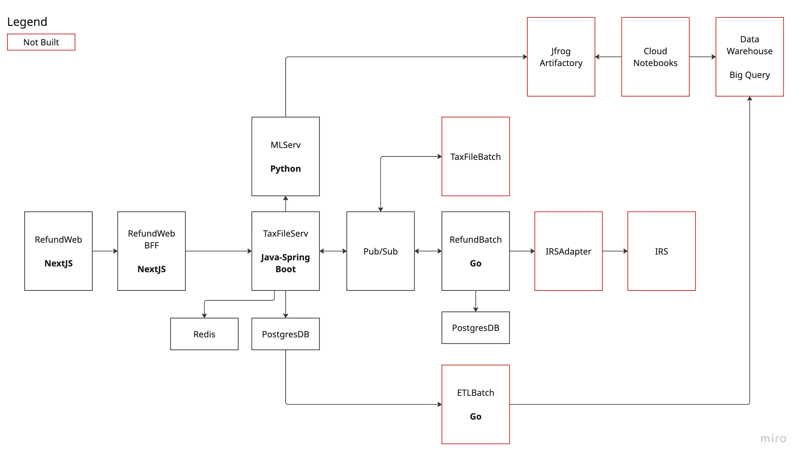

# Tax Refund System Design Presentation

## Table of Contents
1. [About Me](#about-me)
2. [Professional Acheivements](#professional-achievements)
3. [System Design](#system-design)
    - HLD
    - LLD
4. [Q&A Session](#qa-session)

---

## About Me

### Personal Life
• Live in Atlanta area with my spouse and 2 young kids

• I Work from home and Travel occasionally for work

### Geographic Journey
• **Grew up in Coimbatore, India** - where I discovered my love for technology

• **Started career in Pune, India** - learned fundamentals of software development

• **Moved to US in 2012** for work opportunities

• **Lived in Bay Area** - immersed in Silicon Valley tech culture

• **Moved to Chicago** - experienced different tech ecosystem

• **Currently in Atlanta** - workrd for 3 different companies, gained solid knowledge about technology and business

### Professional Passions
• **Love working with young engineers** - helping them grow and develop

• **Active in hackathons** - attend and participate regularly

• **Co-judge at hackathons** - witness incredible creativity and innovation

• **Networking events** - building connections and learning from peers

### Intellectual Interests
• **Philosophy enthusiast** - especially Epistemology (study of knowledge)

• **Karl Popper** - his ideas about falsifiability influence my problem-solving

• **Economics and Business** - fascinated by intersection with technology

• **Systems thinking** - understanding how both software and economic systems work

### Personal Hobbies
• **Blogging** - though admittedly inconsistent (working on it!)

• **Running 5Ks** - especially ones that end with celebratory drinks

• **Reading** - philosophy, economics, and business books

## Did you notice a theme ?

I seem to like **Marathons**, **Hackathons** and **Readathons** 😄

---

## Professional Achievements

### Credit Externalization Platform - KKR & PayPal Partnership
• **Project Overview**: Led the design of a platform for KKR's acquisition of €40bn European BNPL loans from PayPal

• **Business Impact**: Enabled PayPal to free up capital while KKR gained access to diversified consumer loan portfolio

• **Platform Architecture**: Built reusable platform for future credit externalization deals across different markets

• **Technical Components**:
  - **Data Lake Setup**: Centralized data storage and processing infrastructure
  - **BigQuery Database**: Analytics and reporting capabilities for loan portfolio data
  - **GKE Batch Jobs**: Dynamic eligibility filters for loan processing and selection
  - **Risk Platform Integration**: Connected with existing risk assessment systems
  - **KKR Systems Interface**: Seamless data transfer and reporting to investment systems

• **Partnership Success**: Transaction successfully closed in 2023, with platform extended for future deals

• **References**: 
  - [PayPal-KKR Deal Announcement](https://www.fintechfutures.com/bnpl-payments/paypal-to-sell-up-to-40bn-of-european-bnpl-loans-to-kkr)
  - [KKR Asset-Based Finance Insights](https://www.kkr.com/insights/asset-based-finance-buy-now-pay-later)

### Predictive Test Selection Platform
• **Project Origin**: Started as side project after reading Meta's research paper on predictive test selection

• **Problem Identified**: Tests failing due to irrelevant issues, wasting CI/CD resources and developer time

• **Leadership Role**: Led initiative to build intelligent test selection system

• **Key Features Implemented**: [Detailed Feature List](predictive-test-selection-features.md)

• **Technical Implementation**:
  - **ML Model**: XGBoost for tabular data with mixed-type features
  - **Inference Service**: FastAPI-based REST API for real-time predictions
  - **Integration**: Seamless CI/CD integration with build systems

• **Operational Excellence**:
  - **Model Versioning**: Joblib export with rollback capabilities
  - **Retraining**: Automated monthly/monthly model updates

• **Research Foundation**: Based on [Meta's Predictive Test Selection Research](https://research.facebook.com/publications/predictive-test-selection/)

---

## System Design: Tax Refund Status Service

### Problem Statement

[Problem Statement](problem_statement.md)

### High Level Design

Here are the different components of the system

 

Lets Make this design secure

• **AI Integration**: Predict refund timing when not yet processed

• **User Focus**: Clear guidance on refund status and next steps

### Key Requirements
• **User Experience**: Easy refund status checking
• **AI Predictions**: Estimated time for refund availability
• **Security**: Handle sensitive financial data safely
• **Scalability**: High traffic during tax season, lower year-round
• **Reliability**: Accurate info despite external system delays

### System Architecture Overview

#### Core Components
• **User Interface Layer**
  - Web application for user interactions
  - Mobile-responsive design
  - Clear status indicators and action guidance

• **API Gateway & Authentication**
  - Secure user authentication
  - Rate limiting and security controls
  - Request routing and load balancing

• **Business Logic Services**
  - Tax refund status service
  - User management service
  - AI prediction service integration

• **Data Layer**
  - User data storage
  - Tax file management
  - Refund status tracking
  - AI model data and predictions

• **External Integrations**
  - IRS system integration
  - AI/ML model service
  - Notification services

#### Technology Stack
• **Frontend**: Next.js with TypeScript
• **Backend**: Java Spring Boot microservices
• **Database**: PostgreSQL with Redis caching
• **AI/ML**: Python-based prediction service
• **Infrastructure**: Docker containers with cloud deployment
• **Message Queue**: For async processing and batch operations

### Detailed System Design

#### 1. User Authentication & Authorization
• **Multi-factor authentication** for security
• **Role-based access control** for different user types
• **JWT tokens** for session management
• **Audit logging** for compliance tracking

#### 2. Tax Refund Status Flow
• **User Request** → Authentication → Tax File Lookup → Status Check → AI Prediction (if needed) → Response

#### 3. AI Model Integration
• **Training Data**: Historical refund processing times
• **Key Features**: Filing date, income level, refund amount, previous years' data
• **Model**: XGBoost for regression prediction
• **Output**: Estimated days until refund availability

#### 4. Data Architecture
• **User Schema**: Personal information, authentication data
• **Tax File Schema**: Filing details, status, timestamps
• **Refund Schema**: Amount, status, processing timeline
• **Prediction Schema**: AI model outputs and confidence scores

#### 5. Scalability Considerations
• **Horizontal Scaling**: Microservices architecture
• **Caching Strategy**: Redis for frequently accessed data
• **Database Optimization**: Indexing and query optimization
• **Load Balancing**: Multiple service instances
• **CDN**: Static content delivery

#### 6. Security Measures
• **Data Encryption**: At rest and in transit
• **API Security**: Rate limiting, input validation
• **Compliance**: SOC 2, PCI DSS considerations
• **Monitoring**: Security event logging and alerting

### Monitoring & Observability
• **Application Metrics**: Response times, error rates, throughput
• **Business Metrics**: User engagement, prediction accuracy
• **Infrastructure Metrics**: CPU, memory, disk usage
• **Security Metrics**: Failed login attempts, suspicious activity

### Disaster Recovery
• **Backup Strategy**: Regular database backups
• **Failover**: Multi-region deployment
• **Data Recovery**: Point-in-time recovery capabilities
• **Business Continuity**: Service degradation strategies

---

## Q&A Session

### Common Questions & Answers

#### Q: How do you handle the seasonal nature of tax traffic?
• **Auto-scaling** based on traffic patterns
• **Pre-provisioned capacity** during tax season
• **Cost optimization** during off-peak periods

#### Q: What about data privacy and compliance?
• **End-to-end encryption** for all data
• **SOC 2 compliance** standards
• **Detailed audit logs** for all data access

#### Q: How accurate are the AI predictions?
• **Continuous monitoring** of prediction accuracy
• **Model retraining** with new data
• **Confidence scores** provided to users

#### Q: How do you handle IRS system downtime?
• **Circuit breakers** for external service failures
• **Caching strategies** for data availability
• **Graceful degradation** to maintain service

#### Q: What's your approach to testing?
• **Unit tests** for individual components
• **Integration tests** for service interactions
• **Load testing** for performance validation
• **Security testing** for vulnerability assessment

---

## Conclusion

### Key Takeaways
• **System Design** addresses complex tax refund requirements
• **Security & Scalability** maintained throughout
• **AI Integration** provides additional user value
• **Microservices Architecture** ensures reliability
• **Balanced Approach** between technical excellence and business needs

### Final Thoughts
• Users can **trust the system** with sensitive financial data
• **Accurate, timely updates** about tax refunds
• **Ready for discussion** on any aspect of the design

---

*Thank you for your attention. I'm excited to discuss any questions you might have about this system design or my professional experience.*
